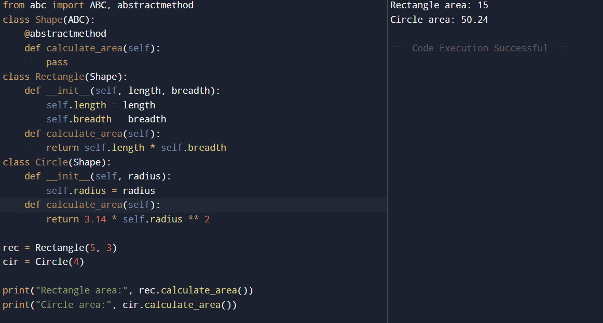

# 🐍 Python OOP: Abstract Class & Method Example

## 🎯 AIM

To create an **abstract class** named `Shape` with an **abstract method** `calculate_area`, and implement this method in two subclasses: `Rectangle` and `Circle`.

---

## 🧠 ALGORITHM

1. **Import ABC module**:
   - Use `from abc import ABC, abstractmethod` to define abstract classes and methods.

2. **Create Abstract Class `Shape`**:
   - Define an abstract method `calculate_area()` with `@abstractmethod`.

3. **Create Subclass `Rectangle`**:
   - Set default values for `length` and `breadth`.
   - Override `calculate_area()` to compute the rectangle area.

4. **Create Subclass `Circle`**:
   - Set default value for `radius`.
   - Override `calculate_area()` to compute the circle area.

5. **Create Objects & Call Methods**:
   - Instantiate `Rectangle` and `Circle`.
   - Call their `calculate_area()` methods.

---

## 💻 Program
```
from abc import ABC, abstractmethod


class Shape(ABC):
    @abstractmethod
    def calculate_area(self):
        pass


class Rectangle(Shape):
    def __init__(self, length, breadth):
        self.length = length
        self.breadth = breadth
    
    def calculate_area(self):
        return self.length * self.breadth


class Circle(Shape):
    def __init__(self, radius):
        self.radius = radius
    
    def calculate_area(self):
        return 3.14 * self.radius ** 2


rec = Rectangle(5, 3)
cir = Circle(4)

print("Rectangle area:", rec.calculate_area())
print("Circle area:", cir.calculate_area())

```
## Output


## Result
